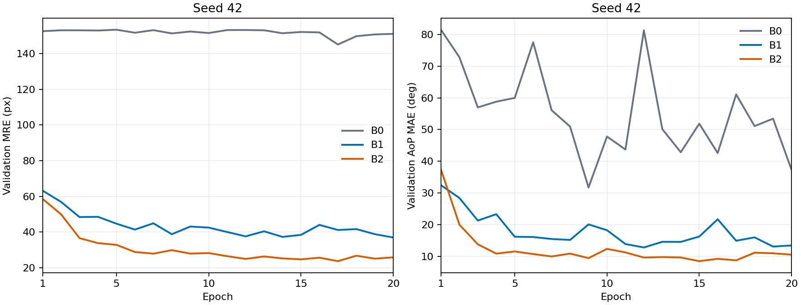
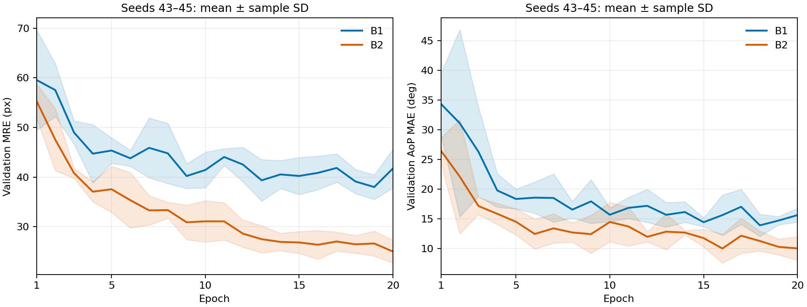

# Phase 0.5：监督损失消融记录

## 问题与范围

目标是把监督部分拆开核对：B0 为 heatmap MSE；B1 为 MSE + coordinate SmoothL1；
B2 再加入 distribution JS。除损失权重外，数据、初始化（同 seed）、模型和训练预算
均保持一致。整个流程只允许 train/validation，testing 保持冻结。

## 固定协议

| 项目 | 设置 |
|---|---|
| 输入 / 热图尺寸 | 512×512 / 256×256 |
| 模型 | HeatmapUNet，base channels=8，484,171 个可训练参数 |
| 优化 | Adam，lr=0.001，weight decay=0.0001，gradient clip=5.0 |
| 预算 | batch size=1，20 epochs，每个版本每个 seed 完全相同 |
| checkpoint | validation DSNT；AoP MAE、总体 MRE、较早 epoch 依次打破平局 |
| 首轮 | seed 42：B0/B1/B2，保留 2 个 |
| 复核 | seed 43/44/45：B1/B2，同种子配对 |

## 全部最佳验证结果

MRE 单位为原图像素，AoP MAE 单位为度。AoP 表中的分母是 100 个可评估样本。

| 版本 | seed | 最佳轮次 | PS1 MRE | PS2 MRE | FH1 MRE | 总体 MRE | AoP MAE | 无效 AoP |
|---|---:|---:|---:|---:|---:|---:|---:|---:|
| B0 | 42 | 9 | 185.124 | 189.055 | 82.773 | 152.317 | 31.731° | 0/100 |
| B1 | 42 | 12 | 23.699 | 40.685 | 48.537 | 37.640 | 12.828° | 0/100 |
| B2 | 42 | 15 | 13.417 | 20.357 | 40.564 | 24.779 | 8.514° | 0/100 |
| B1 | 43 | 18 | 27.701 | 38.737 | 56.909 | 41.116 | 13.718° | 0/100 |
| B2 | 43 | 20 | 13.504 | 18.278 | 37.154 | 22.978 | 7.807° | 0/100 |
| B1 | 44 | 16 | 27.414 | 40.333 | 48.602 | 38.783 | 13.023° | 0/100 |
| B2 | 44 | 16 | 13.285 | 19.591 | 40.561 | 24.479 | 8.317° | 0/100 |
| B1 | 45 | 18 | 27.967 | 43.001 | 48.405 | 39.791 | 12.184° | 0/100 |
| B2 | 45 | 20 | 13.753 | 25.226 | 43.408 | 27.462 | 11.629° | 0/100 |

## 确认轮汇总（seed 43/44/45）

| 版本 | PS1 MRE | PS2 MRE | FH1 MRE | 总体 MRE | AoP MAE |
|---|---:|---:|---:|---:|---:|
| B1 | 27.694 ± 0.277 | 40.690 ± 2.155 | 51.305 ± 4.854 | 39.896 ± 1.170 | 12.975 ± 0.768° |
| B2 | 13.514 ± 0.234 | 21.032 ± 3.692 | 40.374 ± 3.131 | 24.973 ± 2.282 | 9.251 ± 2.075° |

| 指标 | seed 43 | seed 44 | seed 45 | 平均 ± 样本SD |
|---|---:|---:|---:|---:|
| PS1 MRE (px) | -14.197 | -14.129 | -14.215 | -14.180 ± 0.045 |
| PS2 MRE (px) | -20.459 | -20.742 | -17.775 | -19.659 ± 1.637 |
| FH1 MRE (px) | -19.756 | -8.041 | -4.997 | -10.931 ± 7.793 |
| Overall MRE (px) | -18.137 | -14.304 | -12.329 | -14.923 ± 2.953 |
| AoP MAE (deg) | -5.911 | -4.706 | -0.555 | -3.724 ± 2.810 |

三个新种子的配对结果里，B2 的总体 MRE 和 AoP MAE 平均都低于 B1；这支持 JS 项在当前监督基线中的作用，但只有 3 个种子，先不作显著性结论。

## B0 解码检查

B0 使用同一个最佳 checkpoint 分别作 DSNT 与 argmax 解码：

| 解码方式 | PS1 MRE | PS2 MRE | FH1 MRE | 总体 MRE | AoP MAE | 无效 AoP |
|---|---:|---:|---:|---:|---:|---:|
| dsnt | 185.124 | 189.055 | 82.773 | 152.317 | 31.731° | 0/100 |
| argmax | 149.322 | 95.751 | 130.536 | 125.203 | 52.651° | 0/100 |

这项对照只用于检查解码行为，不改变三版本筛选时统一使用 DSNT 的规则。

## 运行时间与显存

| 版本 | seed | 最佳轮次 | 训练(s) | 复评(s) | 显存 allocated/reserved (MB) |
|---|---:|---:|---:|---:|---:|
| B0 | 42 | 9 | 516.5 | 6.2 | 147.4 / 198.0 |
| B1 | 42 | 12 | 543.0 | 3.3 | 147.4 / 198.0 |
| B2 | 42 | 15 | 559.7 | 3.4 | 147.4 / 202.0 |
| B1 | 43 | 18 | 549.8 | 3.5 | 147.4 / 198.0 |
| B2 | 43 | 20 | 567.7 | 3.4 | 147.4 / 202.0 |
| B1 | 44 | 16 | 548.7 | 3.3 | 147.4 / 198.0 |
| B2 | 44 | 16 | 562.5 | 3.4 | 147.4 / 202.0 |
| B1 | 45 | 18 | 554.2 | 3.4 | 147.4 / 198.0 |
| B2 | 45 | 20 | 563.4 | 3.4 | 147.4 / 202.0 |

这里报告的是每次训练、最佳 checkpoint 复评时间，以及框架记录的峰值
allocated/reserved 显存；没有公开设备名称、系统路径或运行环境明细。

## 完整性检查

- 固定 9 次运行均为 20 轮，配置 YAML 与 JSON 完全一致。
- 所有运行的数据指纹在本地相同；公开汇总不包含指纹值。
- 同一 seed 的版本使用相同初始化；B0/B1/B2 的参数量一致。
- 最佳轮次由 20 轮 CSV 按预注册规则重新计算，并与 result/metrics 文件交叉核对。
- 每个 best checkpoint 的文件摘要已与结果记录核对；公开汇总不包含摘要值。
- AoP 的有效数、可评估数、无效预测数和惩罚后 MAE 相互一致。
- testing 没有参与读取、选择或评估。

## 曲线

图中只比较同定义的 validation MRE 与 AoP MAE。由于 B0/B1/B2 的 total loss
由不同项组成，不绘制跨版本 total loss 对比。

## 限制

这份结果仅覆盖监督损失消融，不包含 HRNet、EMA 教师、伪标签和半监督一致性训练。
确认轮只有 3 个 seed，且现有材料没有 subject/group metadata 可做分组拆分审计；
同一 validation 还同时用于选择最佳轮次和报告指标，并不是独立 holdout。
因此这里不做显著性、testing 性能或 SOTA 声明。
