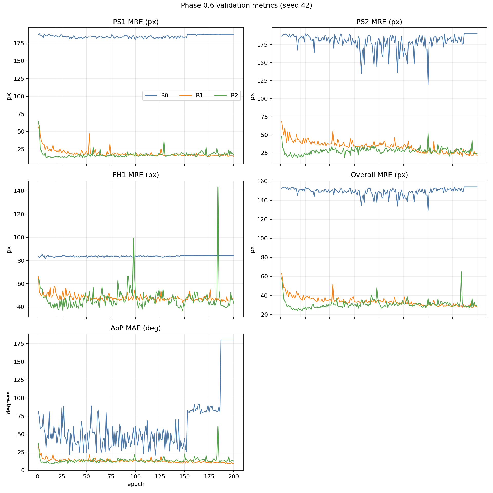

# Phase 0.6：200 轮监督忠实性比较

## 固定条件

| 项目 | 设置 |
|---|---|
| 数据 | train 300，validation 100 |
| 模型 | HeatmapUNet，484,171 个可训练参数 |
| 随机性 | seed 42；三方案初始化、逐轮样本顺序和运行环境完全一致 |
| 预算 | batch size 1，200 epochs，Adam，lr 0.001 |
| 方案 | B0=MSE；B1=MSE+coordinate SmoothL1；B2=B1+JS |
| checkpoint | validation AoP MAE → MRE_ALL → 较早 epoch |
| 数据边界 | 只读 train/validation；testing 冻结 |

这里不比较三方案的 total loss 绝对值。

## epoch 20/50/100/150/200 与 best

### B0

| 位置 | epoch | PS1 MRE | PS2 MRE | FH1 MRE | MRE_ALL | AoP MAE |
|---|---:|---:|---:|---:|---:|---:|
| epoch 20 | 20 | 184.571 | 184.650 | 83.833 | 151.018 | 37.333 |
| epoch 50 | 50 | 182.539 | 177.153 | 84.137 | 147.943 | 23.916 |
| epoch 100 | 100 | 180.409 | 184.289 | 83.881 | 149.526 | 60.847 |
| epoch 150 | 150 | 182.974 | 119.338 | 84.188 | 128.833 | 43.963 |
| epoch 200 | 200 | 187.422 | 190.263 | 84.169 | 153.951 | 180.000 |
| best | 120 | 181.905 | 179.626 | 83.883 | 148.471 | 20.551 |

### B1

| 位置 | epoch | PS1 MRE | PS2 MRE | FH1 MRE | MRE_ALL | AoP MAE |
|---|---:|---:|---:|---:|---:|---:|
| epoch 20 | 20 | 21.437 | 40.078 | 49.500 | 37.005 | 13.457 |
| epoch 50 | 50 | 22.296 | 37.152 | 49.579 | 36.342 | 12.906 |
| epoch 100 | 100 | 17.305 | 35.932 | 48.358 | 33.865 | 13.610 |
| epoch 150 | 150 | 16.383 | 28.122 | 45.848 | 30.118 | 11.962 |
| epoch 200 | 200 | 15.160 | 21.256 | 46.827 | 27.748 | 9.035 |
| best | 194 | 15.455 | 20.514 | 45.283 | 27.084 | 8.767 |

### B2

| 位置 | epoch | PS1 MRE | PS2 MRE | FH1 MRE | MRE_ALL | AoP MAE |
|---|---:|---:|---:|---:|---:|---:|
| epoch 20 | 20 | 14.904 | 19.397 | 43.358 | 25.886 | 10.562 |
| epoch 50 | 50 | 14.439 | 31.368 | 43.811 | 29.873 | 12.921 |
| epoch 100 | 100 | 20.509 | 29.685 | 47.452 | 32.549 | 14.196 |
| epoch 150 | 150 | 17.771 | 52.232 | 40.902 | 36.968 | 22.502 |
| epoch 200 | 200 | 16.903 | 23.733 | 43.295 | 27.977 | 12.624 |
| best | 15 | 13.417 | 20.357 | 40.564 | 24.779 | 8.514 |

## AoP 有效性诊断

| 方案 | 出现任一无效预测的轮数 | 首次出现 | zero-valid轮数 | full-collapse轮数 | 首次full-collapse | epoch 20后full-collapse |
|---|---:|---:|---:|---:|---:|---:|
| B0 | 15 | 177 | 14 | 14 | 187 | 14 |
| B1 | 0 | — | 0 | 0 | — | 0 |
| B2 | 0 | — | 0 | 0 | — | 0 |

zero-valid 表示该轮没有一个有效的预测 AoP；full-collapse 进一步要求所有可评估样本
都产生无效预测。full-collapse 时 valid-only AoP MAE 合法地没有定义，主 AoP MAE
仍按有限惩罚值记录并参与 checkpoint 选择。

B0 首次出现无效AoP预测是在 epoch 177，全程共有 15 轮至少出现1个无效预测；其中 epoch 187–200 连续 14 轮为AoP full-collapse。这些轮次的有效 AoP 预测数为 0，主 AoP MAE 仍保留有限惩罚值；这揭示了只看惩罚后均值会掩盖的后期解码崩溃。

## B0 的 20 轮后变化

- epoch 20：MRE_ALL=151.018 px，
  AoP MAE=37.333°。
- 20 轮后的最佳点在 epoch 120：
  MRE_ALL=148.471 px，
  AoP MAE=20.551°。
- “明显改善”仅作描述性判断：20 轮后的最佳 AoP MAE 至少低 5%，同时 MRE_ALL
  不恶化。本次判断为 **是**。

## 收敛与最终性能的拆分

- 坐标项：B1 best epoch=194，B0 best
  epoch=120；B1 首次同时达到 B0 best 的 AoP MAE 与
  MRE_ALL 阈值：
  epoch 5。
  相对 B0 best，B1 best 的 AoP MAE 下降 57.34%，
  MRE_ALL 下降 81.76%，且优势保持到 epoch 200。
- JS 项：B2 best epoch=15，B1 best
  epoch=194；B2 首次同时达到 B1 best 的两项阈值：
  epoch 15。
  相对 B1 best，B2 best 的 AoP MAE 下降 2.88%，MRE_ALL 下降
  8.51%；但在 epoch 200，B2-B1 的 AoP MAE 为
  +3.589°，MRE_ALL 为 +0.229 px，二者均更差。

这里把“主要改变最终性能”定义为：selected best 在两项主指标上均不差，至少一项
相对改善 5%，并且这种优势在 epoch 200 端点仍没有反转；把“主要加快收敛”定义为：
增强方案早于参照方案的 best epoch，同时达到参照 best 的两项阈值，但不满足上述
持续保持规则。这只是透明的描述性口径，不是统计检验。

## 五个结论

1. **B0在200轮后是否追上B1或B2？**

   对 B1，预算内best：两项主指标均更高，未追上；epoch 200端点：两项主指标均更高，未追上；对 B2，预算内best：两项主指标均更高，未追上；epoch 200端点：两项主指标均更高，未追上。这是seed 42的描述性结果。

2. **坐标项主要改变最终性能，还是主要加快收敛？**

   坐标项（B1相对B0）主要改变最终性能，同时也加快了收敛；同时第 5 轮已达到参照方案在第 120 轮取得的最佳双指标。这里只基于一个seed，不作统计显著性判断。

3. **JS项主要改变最终性能，还是主要加快收敛？**

   JS项（B2相对B1）主要表现为加快收敛：第 15 轮已达到参照方案在第 194 轮取得的最佳双指标；validation-selected best也更优，但epoch 200端点的两项主指标均更差，因此不能概括为持续改善最终性能或长期稳定性。这里只基于一个seed，不作统计显著性判断。

4. **按老师原文采用纯MSE是否仍然具备可行性？**

   仅在工程/复现层面的监督基线意义上具备可行性。B0完整跑完200轮，五项主validation指标按既定惩罚规则保持有限，其best在第 120 轮；但第 187–200 轮连续出现0个有效AoP预测。因此它可训练、可复现，却不具备当前实验中的竞争性和长期稳定性，不能据此声称达到临床、实用或可靠最终方案的性能阈值。

5. **B1/B2是否仍只能被称为增强监督基线？**

   是。B1/B2只是在同一有标注训练流程中增加坐标项或JS项，没有EMA教师、伪标签或无标注一致性目标，因此仍是增强监督基线。

## validation 曲线

图中只有 MRE_PS1、MRE_PS2、MRE_FH1、MRE_ALL 和 AoP MAE，没有绘制跨方案
total loss。

## 完整性与限制

- 三个运行均恰好 200 轮，epoch 连续为 1–200，五项 validation 指标逐轮有限。
- MRE_ALL 已按三个关键点 MRE 的算术均值逐轮复算。
- 每轮 AoP 有效数、无效预测数和 full-collapse 状态均已复核；valid-only 均值仅在
  有有效预测时要求为有限数值。
- best 已按 AoP MAE、MRE_ALL、较早 epoch 的三元组从 CSV 重算，并与
  result、metrics 和 checkpoint 记录交叉核对。
- 三个运行的数据身份、模型初始化、代码版本、协议、环境以及 200 轮训练顺序一致；
  公开文件不包含这些内部摘要值、原始路径或数据指纹。
- testing 没有读取、选择或评估。
- 单 seed 不能支持显著性或稳定性结论；同一 validation 同时用于模型选择和报告。
- 本轮不是完整 GeoEqui-LD，没有 HRNet、解耦、EMA、伪标签或半监督目标。
