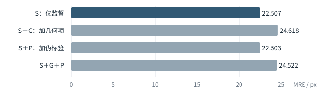

# 产时超声三关键点定位：阶段研究进展

研究进展截至2026-09-22；文字修订于2026-09-23。

本阶段围绕产时超声三关键点定位，完成了概率监督接入、监督训练改进和辅助学习对照。主要进展是让保留HRNet及PS/FH增强的模型能够通过普通DSNT输出可用坐标，并获得更好的监督起点。目前需要集中解决的问题是：怎样让几何一致性和伪标签提供的学习信号，转化为稳定的定位增益。

## 1. 建立可定位的概率监督基础

保留HRNet-W32、PS/FH专业增强与独立解码器，在热图输出后接入坐标误差与JS概率约束，使训练目标同时约束坐标和空间分布。

原e39模型的普通DSNT误差为153.767 px；以其参数为起点，采用坐标误差＋JS和新Adam训练568步后，误差为25.548 px。这项进展建立了可继续检验几何项和伪标签的概率监督基础。

上述数值来自不同训练状态，适配包含监督方式与优化器历史的改变；原热图MSE版本单独保留。

## 2. 改善监督起点，并检验辅助学习的作用

### 监督训练改进

在相同GN8结构、监督定义和60遍训练设置下，两个种子的SAM终点误差均低于历史原生Adam参考。两种子均值由21.853降至20.204 px，差值为−1.649 px，图级条件95%区间为[−2.980, −0.512]。

| 固定种子 | 历史GN8原生Adam | SAM |
|---|---:|---:|
| 20260915 | 22.665 | 19.879 |
| 20260916 | 21.041 | 20.528 |
| 两种子均值 | 21.853 | 20.204 |

SAM每次更新使用两次求导；后补的两步Adam对照未超过SAM。这为后续组件比较提供了更好的监督起点。

### 辅助学习对照

从相同SAM终点继续训练10遍，额外无标签图辅助组的均值为19.882 px，低于仅监督续训的20.245 px；U−S为−0.363 px，条件95%区间为[−0.664, −0.069]。

| 续训设置 | 两种子平均MRE / px |
|---|---:|
| S_ONLY：仅监督 | 20.245 |
| L_AUX：已有图作辅助 | 19.999 |
| U_AUX：额外无标签图作辅助 | 19.882 |

已有图辅助组为19.999 px。复现U−L约−0.116 px，仅作描述；旧U−L比较的区间跨零。当前证据支持辅助流程的收益，额外U来源的独立贡献仍需分离。L/U为实际复现，S沿用已完成终态。

## 3. 组件对照明确了当前的关键矛盾

在同一概率监督起点和固定710步计划下，比较监督损失S、几何一致性G与伪标签P的组合。S与全项组复用已完成记录，其余两组后补。

| 损失组合 | MRE / px |
|---|---:|
| S | 22.507 |
| S＋G | 24.618 |
| S＋P | 22.503 |
| S＋G＋P | 24.522 |

S表示仅监督损失；P仍保留几何筛选。该比较针对概率监督适配的有限配置。

从S到S＋G，固定U32上的学生几何目标均值由0.166降至0.069，而Validation100定位误差由22.507升至24.618 px。几何目标更一致，原图定位却更差，这是当前需要解释的关键矛盾。两项指标分别来自固定U32和Validation100，不是同一批图的逐例关联分析。

加入G后平均误差升高，单独加入P与S接近。已有目标质量和梯度诊断表明，部分伪目标包含纠错信息，也存在更差的目标；相应损失能够参与更新，但这些更新尚未稳定改善整体定位。问题已集中到学习信号的质量、筛选及其与监督更新的配合，仍需用受控比较区分原因。

## 4. 下一阶段工作重点

1. 固定基础：保留HRNet与PS/FH主体，以可定位的概率监督适配和既有监督优化结果确定后续比较的起点。
2. 集中验证：先选一个低标注设置，匹配输入变换与训练预算，检验G/P的独立、协同作用及双置信筛选效果，重点追踪FH严重误差。
3. 补齐主线证据：在获得可归因的改善后，再扩展标注量比较，评价标注效率与独立泛化。

需先明确的研究边界：将坐标误差＋JS作为实现适配固定下来，后续贡献集中于原几何半监督机制；若当前优先级是原MSE定义的严格复现，则先对齐该定义。这个选择决定下一轮的比较基准与计算投入。

## 评价口径

评价统一使用Validation100、三点等权、普通全图DSNT，单位为512输入像素，各阶段分别比较。该验证集已多轮用于开发；图级区间未覆盖未知患者/视频相关性及全部训练随机性。FH仍有超过100 px的误差，AoP改善尚不稳定，需与平均定位误差同时考察。

精确聚合值与比较身份见[SUMMARY.json](SUMMARY.json)。公开代码与既有记录见[项目首页](../../README.md)，研究与实现来源见[来源说明](../../docs/ATTRIBUTION_AND_RELEASE_SCOPE.md)。
